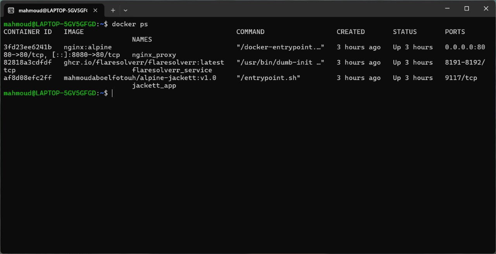
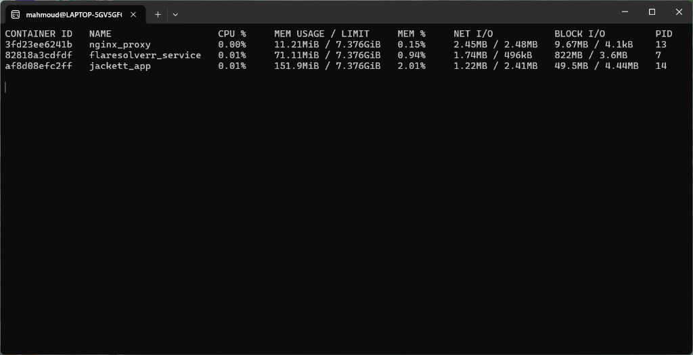

# Alpine Jackett Stack with FlareSolverr & Nginx Reverse Proxy 🚀

A lightweight, secure, and production-ready **Jackett** stack built on **Alpine Linux 3.20**, featuring an intelligent **self-updating runtime entrypoint**, seamless **FlareSolverr** integration (for bypassing Cloudflare / DDoS-Guard anti-bot challenges), and an **Nginx Reverse Proxy** gateway.

---

## 🏗️ Architecture Overview

```
                          [ Client / Web Browser ]
                                     │
                                     │ (HTTP Port 8080)
                                     ▼
                     ┌───────────────────────────────┐
                     │      Nginx Reverse Proxy      │
                     │         (nginx:alpine)        │
                     └───────────────┬───────────────┘
                                     │
                        (Internal Docker Network)
                                     │
                     ┌───────────────▼───────────────┐
                     │         Jackett App           │
                     │    (Custom Alpine Image)      │
                     └───────────────┬───────────────┘
                                     │
                     (Bypass Challenge Requests)
                                     │
                     ┌───────────────▼───────────────┐
                     │         FlareSolverr          │
                     │      (Headless Chromium)      │
                     └───────────────────────────────┘
```

---

## ✨ Key Features

* **🏔️ Ultra-Lightweight Alpine Base:** Custom Docker image built on Alpine Linux (`alpine:3.20`) with minimal memory footprint (~30MB base).
* **🔄 Intelligent Self-Updating Runtime:** Automatically checks GitHub Releases API on container boot, compares versions, and upgrades binaries dynamically without rebuilding images.
* **🔒 Production-Grade Non-Root Security:** Operates under an unprivileged `jackett` user (UID 1000) using `su-exec` and proper permission management.
* **🛡️ Cloudflare Bypass (FlareSolverr):** Out-of-the-box integration with FlareSolverr to solve captcha and Cloudflare anti-bot challenges on protected torrent indexers (e.g. 1337x, TorrentGalaxy).
* **🌐 Nginx Reverse Proxy:** Unified entry point managing WebSocket connections, headers (`X-Real-IP`, `X-Forwarded-For`), and request timeouts.
* **💾 Persistent Storage:** Named volumes (`Jackett_Config` and `Jackett_App`) ensuring configuration, indexers, and binaries persist across container re-creations.

---

## 🚀 Quick Start

### 1. Clone the repository
```bash
git clone https://github.com/Mahmoud-Abo-El-Fotouh/jackett-flaresolverr-docker.git
cd jackett-flaresolverr-docker
```

### 2. Launch the full stack
```bash
docker compose up --build -d
```

### 3. Access Jackett Web UI
Open your browser and navigate to:
👉 **`http://localhost:8080`**

---

## 📸 Live Stack & Performance Preview

### 1. Running Containers (`docker ps`)


### 2. Resource Utilization (`docker stats`)


---

## ⚙️ Connecting FlareSolverr in Jackett

1. Open the Jackett dashboard at `http://localhost:8080`.
2. Scroll down to the **Server Configuration** section.
3. In the **FlareSolverr API URL** field, enter:
   ```text
   http://flaresolverr:8191
   ```
4. Click the **Apply server settings** button to save changes.
5. Add any Cloudflare-protected indexer (e.g., `1337x`) and click **Test** to verify.

---

## 🔌 Desktop Client Integration (qBittorrent)

You can connect qBittorrent's built-in search engine directly to this stack using either of the following methods:

### Method 1: Direct Configuration File (`jackett.json`) — Recommended for Windows

1. Copy your **API Key** from the top right of the Jackett UI (`http://localhost:8080`).
2. Press `Win + R`, paste the following path, and press `Enter`:
   ```text
   %localappdata%\qBittorrent\nova3\engines
   ```
3. Open `jackett.json` with any text editor and configure:
   ```json
   {
       "api_key": "YOUR_JACKETT_API_KEY_HERE",
       "url": "http://127.0.0.1:8080"
   }
   ```
4. Save and close the file.

### Method 2: Via qBittorrent Search UI

1. In qBittorrent, enable the search engine via **View** -> **Search Engine**.
2. Open the **Search** tab and click **Search plugins...** in the bottom right.
3. Locate **Jackett** in the plugin list (or click *Check for updates* if missing).
4. Right-click on the **Jackett** plugin -> select **Edit** / double-click:
   * **URL:** `http://127.0.0.1:8080`
   * **API Key:** Paste your Jackett API Key.
5. Save changes.

You can now search across all configured indexers directly from qBittorrent!

---

## 📦 Docker Hub Pre-built Image

The pre-built, lightweight Jackett image is available on Docker Hub:

```bash
docker pull mahmoudaboelfotouh/alpine-jackett:v1.0
```

---

## 📁 Repository Structure

```text
jackett-flaresolverr-docker/
├── jackett/
│   ├── Dockerfile         # Custom Alpine-based Dockerfile with .NET dependencies
│   └── entrypoint.sh      # Auto-updating, non-root initialization shell script
├── nginx/
│   └── default.conf       # Reverse proxy routing and header forwarding configuration
├── docker-compose.yaml    # Multi-container orchestration (Jackett + FlareSolverr + Nginx)
├── .gitignore             # Ignored runtime and local environment files
└── README.md              # Project documentation
```

---

## 📝 License

This project is open-source and available under the [MIT License](LICENSE).
